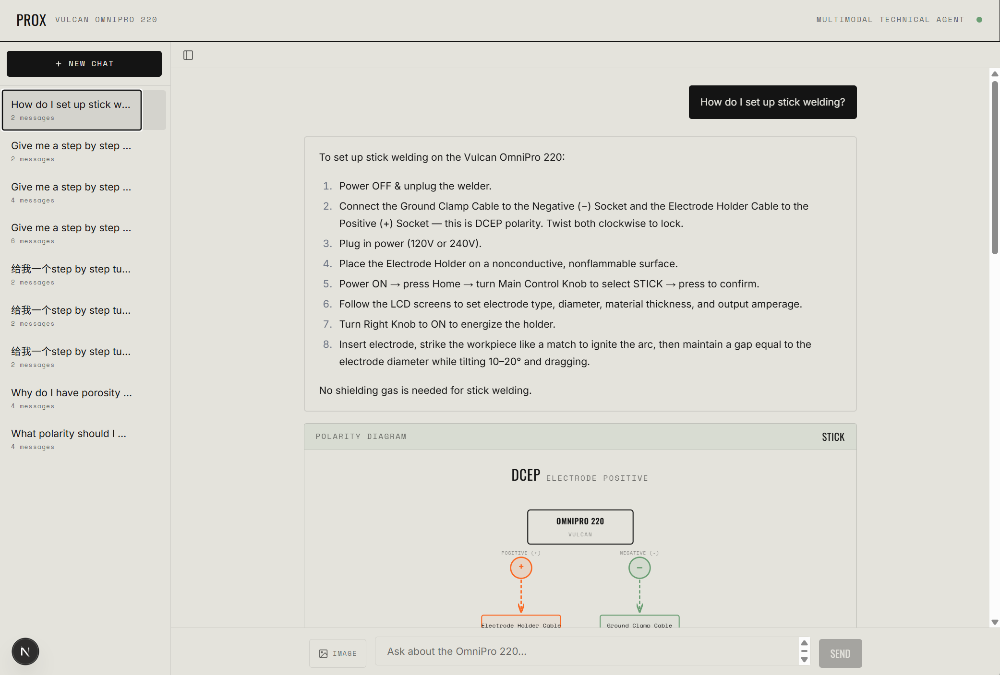
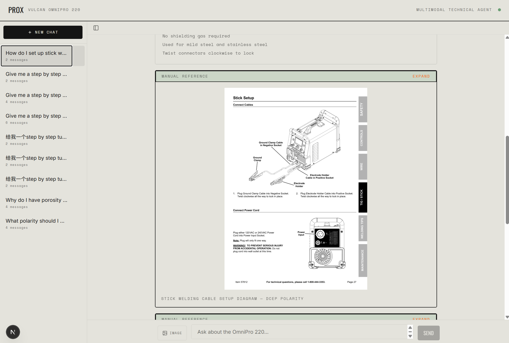
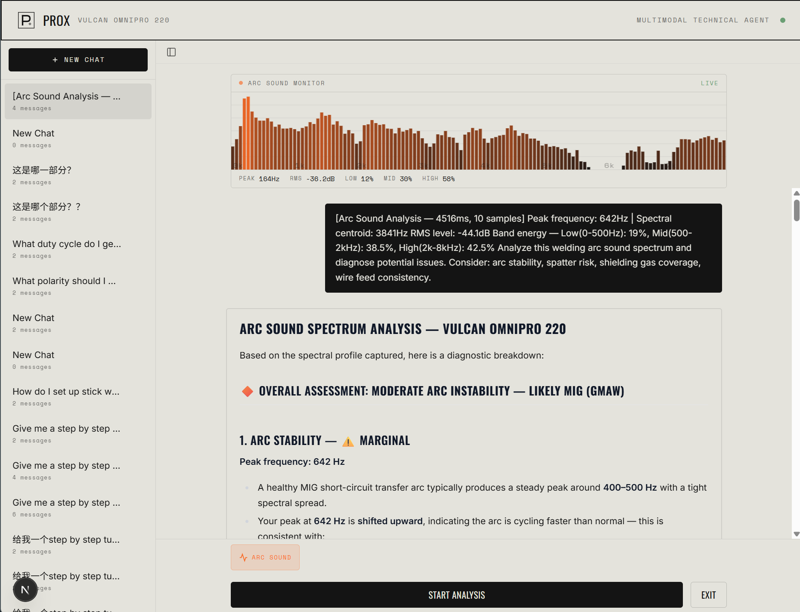
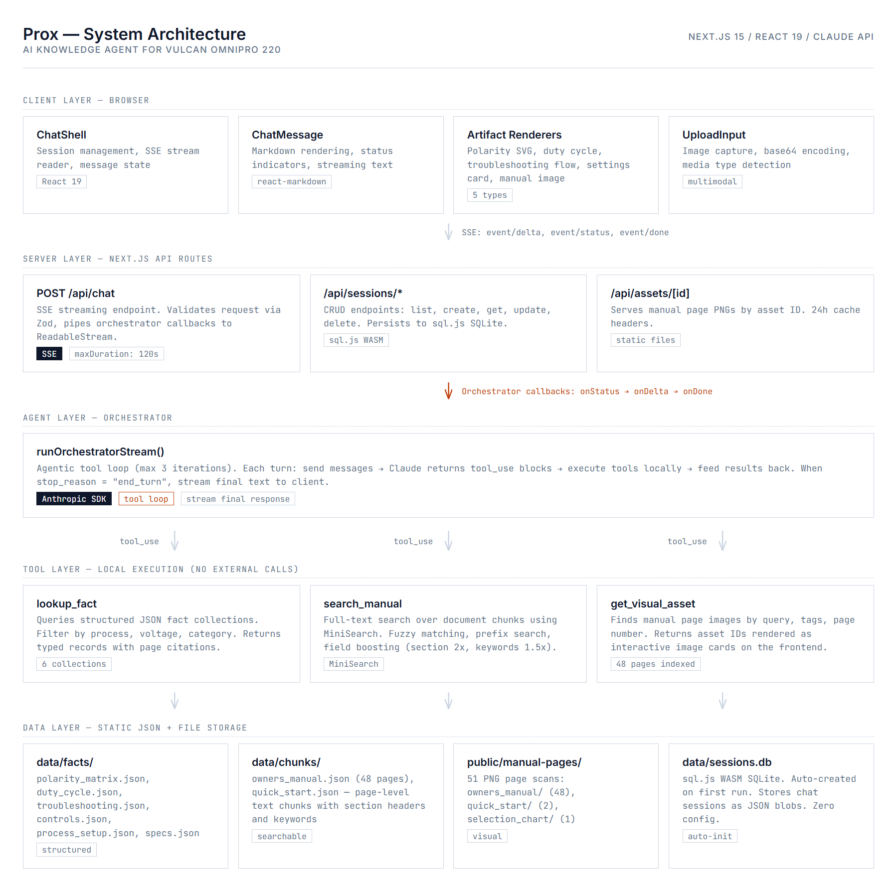

# Prox

A multimodal AI knowledge agent for the Vulcan OmniPro 220 multiprocess welder. It answers technical questions by looking up structured facts, searching the manual full-text, and pulling up the actual manual page images. Every answer is grounded in the source documents.

Built with Next.js 15, React 19, the Anthropic SDK, and a local knowledge base. No vector database, no external services beyond the Claude API.





## Architecture



Interactive HTML version: [`docs/architecture.html`](docs/architecture.html).

## How the agent works

The core is `lib/agent/orchestrator.ts`. When a user sends a message:

1. The orchestrator collects conversation history and the current message (text + optional image), then sends everything to the Claude API with the system prompt and three tool definitions.

2. Claude decides which tools to call. The orchestrator executes them locally and feeds results back, looping up to 3 iterations. All tool execution is server-side, reading from static JSON files on disk.

3. Once Claude produces its final answer (JSON with `answer`, `citations`, `artifacts`, optional `clarification`), the orchestrator sends it to the browser via SSE. The frontend renders the markdown text, then builds any artifacts (SVG diagrams, image cards, configurator tables, settings cards) from the structured response.

The model never generates freeform text. Every response is validated against a Zod schema. If the JSON is malformed or truncated, a fallback parser extracts what it can via regex.

## Knowledge base

The knowledge base was built by extracting content from three source documents for the Vulcan OmniPro 220:

`data/facts/` -- Seven JSON collections: polarity configurations, duty cycle ratings, front panel controls, troubleshooting trees, process setup procedures, equipment specs, and recommended weld settings by process/material/thickness. Each record has source citations (document ID + page number). The `lookup_fact` tool queries these with key-value filters, e.g. `{process: "mig", material: "Mild Steel", thickness: "3/16\""}`.

`data/chunks/` -- The owner's manual (48 pages) and quick start guide, split into page-level text chunks with section headers and keyword arrays. The `search_manual` tool indexes these with MiniSearch at startup: fuzzy matching, prefix search, field boosting (section headers 2x, keywords 1.5x).

`data/visual_assets.json` + `public/manual-pages/` -- 51 PNG page scans indexed with titles and tags (polarity, controls, duty_cycle, troubleshooting, setup, wiring). The `get_visual_asset` tool finds relevant pages by tag filtering and term matching. The frontend shows these as expandable image cards with zoom modals.

The three layers complement each other. "What polarity for MIG?" hits the structured lookup. "How do I set up stick welding?" runs a full-text search. "Show me the cable setup diagram" pulls the actual manual page. A compound question can trigger all three in one turn.

## Design decisions

**Local tools over RAG.** For a 48-page technical manual with well-defined categories (polarity, duty cycle, troubleshooting), structured JSON lookups give more precise results than embedding similarity. MiniSearch covers the long-tail questions that don't fit a structured collection.

**Agentic tool loop over single-shot.** Claude picks its own tools and can iterate. "What polarity for stick and show me the setup diagram" triggers both `lookup_fact` and `get_visual_asset` in one turn without any routing logic.

**SSE over WebSocket.** Communication is server-to-client only. Three event types: `status` (tool progress), `delta` (text), `done` (structured response with artifacts and citations).

**sql.js over native SQLite.** Pure WASM, no native compilation. `pnpm install` and it works on any OS. The database file auto-creates on first startup.

**Typed artifacts over raw markdown.** Responses include typed artifact objects (polarity diagrams, duty cycle widgets, troubleshooting flows, weld configurators, settings cards, manual images). Each type has a dedicated React component. This keeps layouts consistent regardless of what the model outputs.

**Zod at every boundary.** Request validation, response parsing, artifact type discrimination. If the model returns bad JSON, the fallback parser extracts the answer field via regex instead of showing raw JSON.

## Sensor tools

The toolbar has two sensor modes next to the chat input. One uses the microphone, the other uses the camera.

### Arc sound analysis

Uses the Web Audio API to capture and analyze welding arc sounds in real time.

Click "Arc Sound" to open a live FFT spectrogram. The browser captures mic audio via `getUserMedia`, routes it through an `AnalyserNode` (2048-point FFT, 0-8 kHz), and renders a frequency bar visualization on a high-DPI canvas at 60 fps.

Every 500 ms, the monitor extracts: peak frequency, spectral centroid, RMS level (dB), and band energy ratios (low 0-500 Hz, mid 500-2 kHz, high 2-8 kHz). When the user starts analysis, these features get buffered and flushed to Claude every 5 seconds alongside reference ranges for real welding arcs (RMS -25 to -5 dB, broad spectral energy, high-band >30%).

Claude compares readings against known welding signatures. If the audio doesn't look like welding (RMS below -35 dB, narrow spectrum), it says so instead of guessing.

The welder runs their arc and gets feedback on stability, spatter, shielding gas coverage, and wire feed without stopping to type.

### Weld bead inspector

Uses the device camera to photograph and analyze completed weld beads.

Click "Weld Inspector" to open a live camera preview with a crosshair overlay. The browser opens the camera via `getUserMedia` with `facingMode: "environment"` (rear camera on mobile for close-up shots).

Position the camera over the bead, click "Capture & Analyze." The component snapshots the video frame to canvas, converts to JPEG base64, and sends it to Claude Vision with an inspection prompt: bead profile, surface quality, heat indicators, penetration assessment. Claude returns a quality rating with specific recommendations, pulling from the OmniPro 220 knowledge base where relevant.

Arc Sound is for the process (during welding). Weld Inspector is for the result (after welding). The two modes are mutually exclusive.

## Weld settings configurator

When a user specifies process, material, and thickness, the agent generates a Weld Configurator card with recommended parameters. The data comes from a `weld_settings` collection covering MIG, flux-core, TIG, and stick across mild steel, stainless, and chrome moly, from 24 gauge up to 1/4".

The card shows power settings (amperage, voltage, polarity), wire/electrode/tungsten details (varies by process), and shielding gas. All values come from the manufacturer's selection chart.

## Getting started

### Prerequisites

- Node.js 18+
- pnpm
- An Anthropic API key (or compatible proxy)

### Setup

```bash
git clone <repo-url>
cd prox
pnpm install
cp .env.example .env.local
```

Edit `.env.local` and add your API key:

```
ANTHROPIC_API_KEY=sk-ant-...
```

Other variables are optional:

| Variable | Default | Description |
|----------|---------|-------------|
| `ANTHROPIC_API_KEY` | -- | Required. Your Claude API key. |
| `BASE_URL` | Anthropic default | API endpoint. Set if using a proxy. |
| `MODEL_NAME` | `claude-sonnet-4-6` | Model ID for the orchestrator. |
| `MAX_OUTPUT_TOKENS` | `4096` | Max tokens per response (capped at 8192). |

### Run

```bash
pnpm dev
```

Open [http://localhost:3000](http://localhost:3000). No database setup needed, sessions are stored in a local SQLite file that creates itself on first run.

### Build for production

```bash
pnpm build
pnpm start
```

### Deploy on Ubuntu

```bash
npm i -g pm2
pnpm build
pm2 start npm --name prox -- start
pm2 save && pm2 startup
```

Put nginx in front for HTTPS. Set `proxy_buffering off` so SSE responses are not buffered.

## Project structure

```
prox/
├── app/
│   ├── api/
│   │   ├── chat/route.ts            # SSE endpoint
│   │   ├── sessions/route.ts        # Session list + create
│   │   ├── sessions/[id]/route.ts   # Session CRUD
│   │   └── assets/[id]/route.ts     # Manual page image server
│   ├── layout.tsx
│   ├── page.tsx
│   └── globals.css
├── components/
│   ├── chat/
│   │   ├── chat-shell.tsx           # Main chat UI + state
│   │   ├── chat-message.tsx         # Message rendering
│   │   ├── session-sidebar.tsx      # Session list
│   │   ├── prompt-suggestions.tsx   # Starter prompts
│   │   └── upload-input.tsx         # Image upload
│   ├── audio/
│   │   └── arc-sound-monitor.tsx    # FFT + feature extraction
│   ├── camera/
│   │   └── weld-inspector.tsx       # Camera capture + bead inspection
│   ├── artifacts/
│   │   ├── artifact-switch.tsx      # Routes artifact type -> component
│   │   ├── polarity-diagram-card.tsx
│   │   ├── duty-cycle-card.tsx
│   │   ├── troubleshooting-flow-card.tsx
│   │   ├── weld-configurator-card.tsx
│   │   ├── settings-card.tsx
│   │   └── manual-image-card.tsx
│   └── source-viewer/
│       └── citation-badge.tsx
├── lib/
│   ├── agent/
│   │   ├── orchestrator.ts          # Tool loop + streaming
│   │   ├── system-prompt.ts         # Claude system prompt
│   │   └── tools.ts                 # Tool definitions + executors
│   ├── knowledge/
│   │   ├── loader.ts                # JSON file loader
│   │   ├── facts.ts                 # Structured fact queries
│   │   ├── search.ts                # MiniSearch full-text index
│   │   ├── visuals.ts              # Visual asset lookup
│   │   └── types.ts
│   ├── schemas/
│   │   ├── response.ts              # ChatResponse + artifact schemas
│   │   ├── knowledge.ts
│   │   └── tools.ts
│   ├── db.ts                        # sql.js init
│   └── sessions.ts                  # Session CRUD
├── data/
│   ├── facts/                       # Structured fact JSON
│   │   ├── polarity_matrix.json
│   │   ├── duty_cycle.json
│   │   ├── controls.json
│   │   ├── troubleshooting.json
│   │   ├── process_setup.json
│   │   ├── specs.json
│   │   └── weld_settings.json
│   ├── chunks/                      # Manual text chunks
│   └── visual_assets.json           # Page image index
├── public/
│   └── manual-pages/                # 51 PNG page scans
├── docs/
│   └── architecture.html
└── screenshot/
```

## What's next

**Hybrid search with sqlite-vec.** MiniSearch handles exact terminology fine ("DCEP polarity", "duty cycle 240V") but misses semantic matches when the user's phrasing differs from the manual's. [sqlite-vec](https://github.com/asg017/sqlite-vec) would add embedding-based similarity without requiring an external vector database. Embed chunks at build time, store in a virtual table, combine lexical and cosine scores at query time.

**Prompt caching.** The system prompt and tool definitions are identical across every request. Anthropic's prompt caching would cut input token costs and latency for repeat conversations.

**Multi-document scaling.** Right now the knowledge extraction is manual, hand-curated for one welder model. To support more equipment: automated PDF parsing with layout detection, section-based chunking, and LLM-driven fact extraction. The tool interface and frontend wouldn't change.

## Tech stack

| Layer | Technology |
|-------|-----------|
| Framework | Next.js 15 |
| UI | React 19, Tailwind CSS 4, react-markdown, remark-gfm |
| AI | Anthropic SDK, Claude Sonnet |
| Audio | Web Audio API (AnalyserNode, FFT), getUserMedia |
| Vision | getUserMedia (camera), Canvas API, Claude Vision |
| Search | MiniSearch (lexical full-text) |
| Database | sql.js (WASM SQLite) |
| Validation | Zod |
